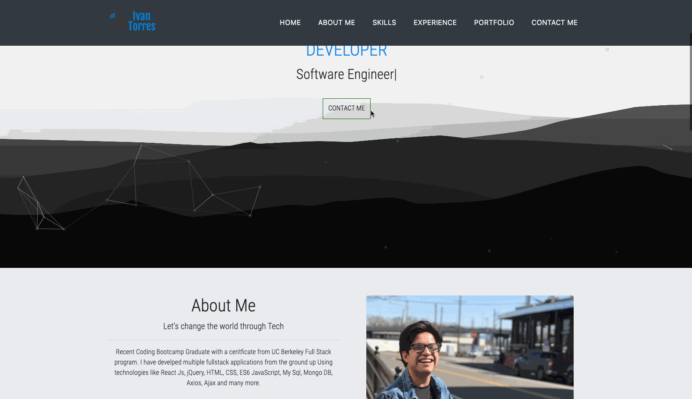

# Portfolio


## Table of Contents
* [Description](#Description)
* [Links](#Links)
* [Technologies](#Technologies)
* [Gif](#Gif)
* [Author](#Author)
* [Credits](#Credits)
* [License](#License)

## Description 
Hi welcome to my portfolio, This is currently being built and will be deployed as soon as it's a completed state. 


## Technologies
* [JavaScript](https://www.w3schools.com/js/)
* [AOS](https://michalsnik.github.io/aos/)
* [ReactJs](https://reactjs.org/)
* [React-Router](https://reactrouter.com/)
* [CSS](https://www.w3schools.com/css/)
* [HTML](https://www.w3schools.com/html/)
* [JSX](https://reactjs.org/docs/introducing-jsx.html)
* [React-Particles-Js](https://www.npmjs.com/package/react-particles-js)
* [React-Typed](https://www.npmjs.com/package/react-typed)


## Gif
- Decided to put gif of how to project is going. I will update the gif when the portfolio is finished.


## Code

### 
 - 

 ```
 
 ```

### 
 - 

 ```

 ```

 ###

- 

```

```


## Author
Ivan Torres
* [GitHub](https://github.com/IvanTorresMia)
* [linkedIn](www.linkedin.com/in/ivan-torres-0828931b2)

## Credits
* Credits For this projet goes out to my former instructers and TA's that taught me how to code as well as friends who give me feed back on how to make my projects better. I would also shout out StackOverFlow and google.
* [StackOverFlow](https://stackoverflow.com/)


## License]
[](https://www.mit.edu/~amini/LICENSE.md)

