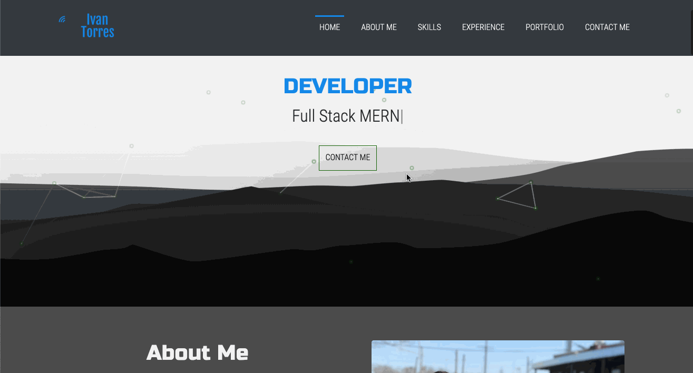

# Portfolio

## Table of Contents

- [Description](#Description)
- [Deployed Link](#Deployed-Link)
- [Technologies](#Technologies)
- [Gif](#Gif)
- [Author](#Author)
- [Credits](#Credits)
- [License](#License)

## Description

Hi welcome to my portfolio, This is currently being built and will be deployed as soon as it's a completed state.

## Deployed-Link

- [Click Here](https://ivantorresmia.github.io/Portfolio/)

## Technologies

- [JavaScript](https://www.w3schools.com/js/)
- [AOS](https://michalsnik.github.io/aos/)
- [ReactJs](https://reactjs.org/)
- [React-Scroll](https://www.npmjs.com/package/react-scroll)
- [CSS](https://www.w3schools.com/css/)
- [HTML](https://www.w3schools.com/html/)
- [JSX](https://reactjs.org/docs/introducing-jsx.html)
- [React-Particles-Js](https://www.npmjs.com/package/react-particles-js)
- [React-Typed](https://www.npmjs.com/package/react-typed)
- [Material-Ui](https://material-ui.com/)
- [Font-Awesome](https://fontawesome.com/)
- [EmailJs](https://www.emailjs.com/)
- [React-Bootstrap](https://react-bootstrap.github.io/)

## Gif



## Code

### Particles Js

- Impementinc Particles Js was fun, it's as easy as installing it via npm or yarn then using params to dictate and manipulate the particles

* Installation

```
npm install react-particles-js || yarn add react-particles-js
```

- App.js

```
// this is just part of App.js to show particles js.

import Particles from "react-particles-js";

    <Particles
     className="particles-canvas"
     params={{
       particles: {
         number: {
           value: 30,
           density: {
             enable: true,
             value_area: 900
           }
         },
         shape: {
           type: "circle",
           stroke: {
             width: 6,
             color: "#156307"
           }
         }
       }
     }}
     />
```

- css

```
/* it's important to make the component position relative and particles js obsolute to layer it over the component  */

.header-wraper {
  position: relative;
  background: url(background2.jpg) no-repeat;
  background-size: cover;
  background-position: center;
  height: 90vh;
}

.tsparticles-canvas-el {
  position: absolute;
  height: 100vh;
  width: 100vw;
  z-index: 1;
}
```

### Material-UI

* Material UI was a new technology for me, so implementing it to my portfolio exciting

- installation

```
npm install @material-ui/core
```

###

-

```

```

## Author

Ivan Torres

- [GitHub](https://github.com/IvanTorresMia)
- [linkedIn](www.linkedin.com/in/ivan-torres-0828931b2)

## Credits

- Credits For this projet goes out to my former instructers and TA's that taught me how to code as well as friends who give me feed back on how to make my projects better. I would also shout out StackOverFlow and google.
- [StackOverFlow](https://stackoverflow.com/)

## License]

[](https://www.mit.edu/~amini/LICENSE.md)
